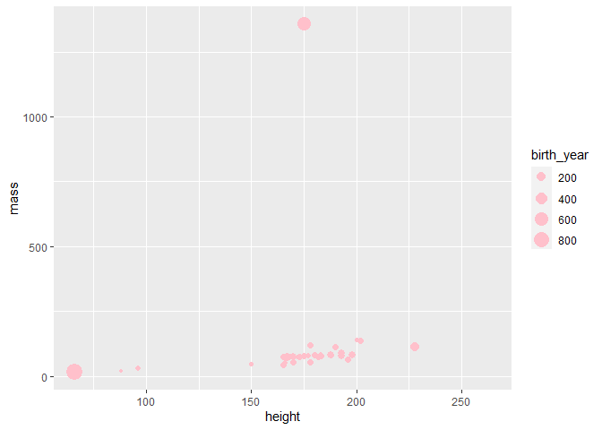
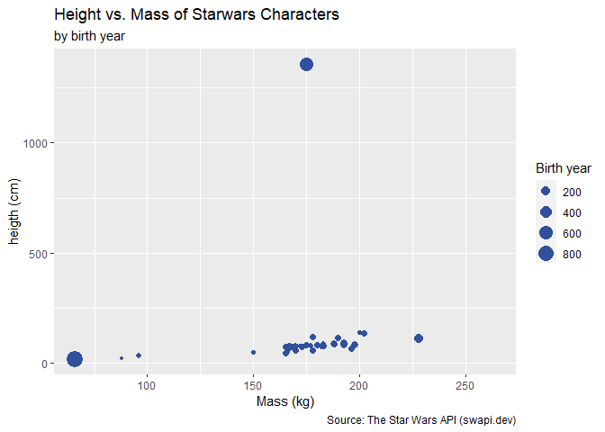
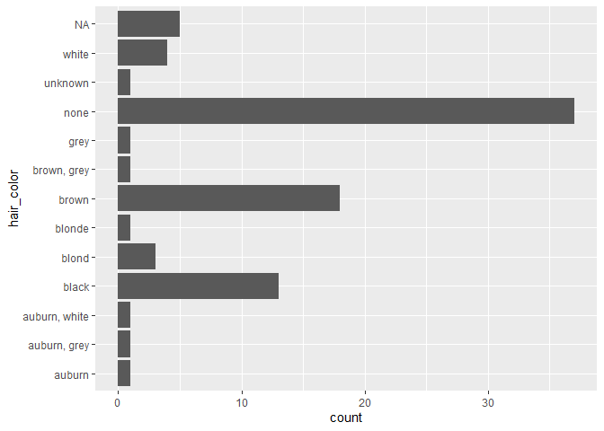
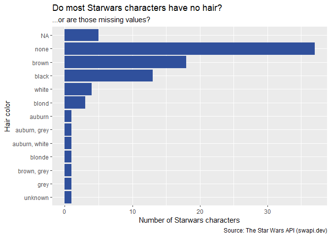
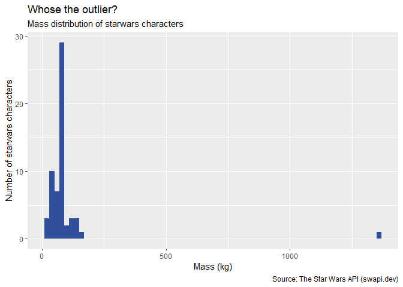
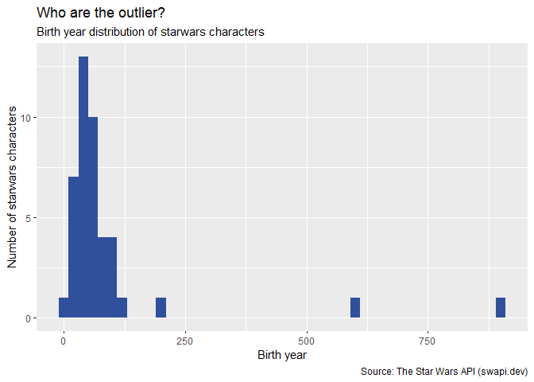

Visualizing Starwars characters — Solutions
================
Lukas Jürgensmeier

### Glimpse at the starwars data frame.

``` r
glimpse(starwars)
```

    ## Rows: 87
    ## Columns: 14
    ## $ name       <chr> "Luke Skywalker", "C-3PO", "R2-D2", "Darth Vader", "Leia...
    ## $ height     <int> 172, 167, 96, 202, 150, 178, 165, 97, 183, 182, 188, 180...
    ## $ mass       <dbl> 77.0, 75.0, 32.0, 136.0, 49.0, 120.0, 75.0, 32.0, 84.0, ...
    ## $ hair_color <chr> "blond", NA, NA, "none", "brown", "brown, grey", "brown"...
    ## $ skin_color <chr> "fair", "gold", "white, blue", "white", "light", "light"...
    ## $ eye_color  <chr> "blue", "yellow", "red", "yellow", "brown", "blue", "blu...
    ## $ birth_year <dbl> 19.0, 112.0, 33.0, 41.9, 19.0, 52.0, 47.0, NA, 24.0, 57....
    ## $ sex        <chr> "male", "none", "none", "male", "female", "male", "femal...
    ## $ gender     <chr> "masculine", "masculine", "masculine", "masculine", "fem...
    ## $ homeworld  <chr> "Tatooine", "Tatooine", "Naboo", "Tatooine", "Alderaan",...
    ## $ species    <chr> "Human", "Droid", "Droid", "Human", "Human", "Human", "H...
    ## $ films      <list> [<"The Empire Strikes Back", "Revenge of the Sith", "Re...
    ## $ vehicles   <list> [<"Snowspeeder", "Imperial Speeder Bike">, <>, <>, <>, ...
    ## $ starships  <list> [<"X-wing", "Imperial shuttle">, <>, <>, "TIE Advanced ...

### Modify the following plot to change the color of all points to `"pink"`.

You can use standard colors by referring to their name, e.g.,
`colour = "pink"`, or supply a custom Hex color code (e.g.,
`colour = "#30509C"`).

``` r
ggplot(starwars, 
       aes(x = height, y = mass, color = gender, size = birth_year)) +
  geom_point(color = "pink")
```

    ## Warning: Removed 51 rows containing missing values (geom_point).

<!-- -->

### Add labels for title, x and y axes, and size of points. Uncomment to see the effect.

Accurate labels are extremely important to bring across the chart’s
desired message. You can specify them within the `labs()` layer.

``` r
ggplot(starwars, 
       aes(x = height, y = mass, color = gender, size = birth_year)) +
  geom_point(color = "#30509C") +
  labs(
    title = "Height vs. Mass of Starwars Characters",
    subtitle = "by birth year",
    x = "Mass (kg)",
    y = "heigth (cm)",
    size = "Birth year",
    caption = "Source: The Star Wars API (swapi.dev)"
    )
```

    ## Warning: Removed 51 rows containing missing values (geom_point).

<!-- -->

### Pick a single categorical variable from the data set and make a bar plot of its distribution.

This sample solution provides the easiest possible solution and a more
advanced one. Note the huge difference between the ease of understanding
the data.

The simplest possible barplot, which is hard to understand:

``` r
ggplot(starwars, aes(y = hair_color)) +
  geom_bar()
```

<!-- -->

And in comparison, a little more advanced barplot (note that I’m using
functions and tools that will be introduced later in this course):

``` r
starwars %>% 
  # reorders the hair color variable by descending frequency
  mutate(hair_color = fct_rev(fct_infreq(hair_color))) %>% 
  # start plotting
  ggplot(aes(y = hair_color)) +
  # common pitfall: use `fill =` instead of `color =`
  geom_bar(fill = "#30509C") +
  labs(
    title = "Do most Starwars characters have no hair?",
    subtitle = "...or are those missing values?",
    x = "Number of Starwars characters",
    y = "Hair color",
    caption = "Source: The Star Wars API (swapi.dev)"
    )
```

<!-- -->

### Pick a single numerical variable and make a histogram of it.

We didn’t cover histograms specifically, but the code structure is the
same.

``` r
ggplot(starwars, aes(x = mass)) +
  geom_histogram(fill = "#30509C", binwidth = 20) +
  labs(
    title = "Whose the outlier?",
    subtitle = "Mass distribution of starwars characters",
    x = "Mass (kg)",
    y = "Number of starwars characters",
    caption = "Source: The Star Wars API (swapi.dev)"
    )
```

    ## Warning: Removed 28 rows containing non-finite values (stat_bin).

<!-- -->

``` r
ggplot(starwars, aes(x = birth_year)) +
  geom_histogram(fill = "#30509C", binwidth = 20) +
  labs(
    title = "Who are the outlier?",
    subtitle = "Birth year distribution of starwars characters",
    x = "Birth year",
    y = "Number of starwars characters",
    caption = "Source: The Star Wars API (swapi.dev)"
    )
```

    ## Warning: Removed 44 rows containing non-finite values (stat_bin).

<!-- -->
